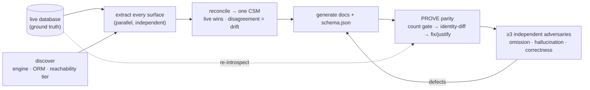

# database-docs

Generate database documentation that is **provably** the schema, not a plausible guess at it. A
half-correct schema doc is worse than none — people trust it and write broken code.

The skill grounds every statement in the **live database** (system-catalog introspection) and treats the
ORM, migrations, generated types, and seeds as mere *claims* to cross-check. It then **proves** completeness
mechanically: re-introspect the database and diff it against the generated docs until the diff is empty.
Output is mermaid ER diagrams, per-table data dictionaries, and a machine-readable `schema.json`.

Engine-agnostic (PostgreSQL, MySQL, SQL Server, SQLite) and ORM-agnostic (Prisma, TypeORM, Drizzle,
Sequelize, Knex, Django, Rails, raw SQL). Platform-agnostic: uses parallel subagents and a live DB when
available, and degrades gracefully — never fabricating what it could not read.

## Architecture



## Why it works

- **The live DB is the oracle.** A frontier model left to itself reads the ORM and ships an incomplete,
  partly-hallucinated schema (missed CHECK-constraint enums, wrong `ON DELETE`, omitted legacy tables,
  invented columns). Grounding in the catalog defeats that.
- **Verified, not claimed.** A mechanical count gate (population-matched per object class) is the tripwire;
  an identity-diff against a fresh introspection is the proof. "Verified" is written only when the diff is
  empty.
- **Judgment is never one agent's call.** Because the reviewer shares the writer's blind spots, ≥3
  context-walled adversaries (omission / hallucination / correctness) hunt for what one pass misses.

Confidence is tiered (T1 live + subagents + adversaries → T5 single static surface) and announced, so a
reader always knows whether the docs were verified against a live database.

## Scope

v1 targets relational/SQL engines. Document stores (MongoDB) and graph databases are detected and flagged
as out of scope rather than mis-documented.

## Benchmark

`benchmarks/database-docs/` — a deterministic ground-truth extractor + parity scorer over a public,
reproducible dual-dialect fixture, plus maintainer-run results on private real apps. Measures the same model
with the skill vs without; reports `exact_parity` (zero defects) and `total_defects` per object class.

## Install

```bash
npx skills add a-tokyo/agent-skills --skill database-docs
```
