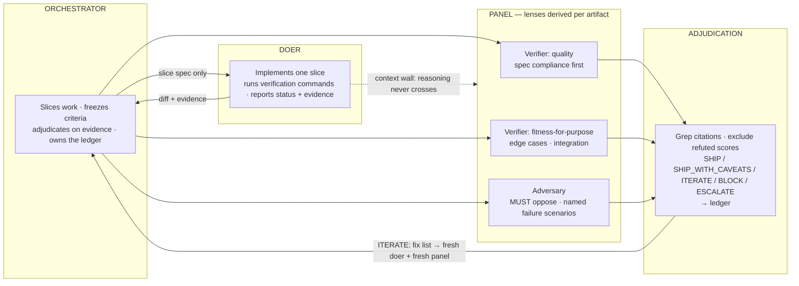

# tribunal

Doer → verifier-panel → consensus: a delivery-verification pattern for orchestrating
agents. An orchestrator freezes acceptance criteria before implementation, dispatches a
doer, then convenes a context-walled panel of independent verifiers — including an
adversary with an explicit must-oppose mandate — for evidence-anchored review
adjudicated to a SHIP / SHIP_WITH_CAVEATS / ITERATE / BLOCK / ESCALATE verdict.

Start at [SKILL.md](SKILL.md). Mechanics live in [references/](references/): consensus
mechanics (triggers, synthesis, resolution math, adjudication), a worked end-to-end
example, and an anti-pattern catalogue. The skill is principles-first: panel size,
lenses, scoring dimensions, prompts, and record shapes are derived per artifact from a
small set of hard invariants rather than prescribed.

Works with any agent platform that can spawn parallel subagents; degrades to sequential
fresh-context sessions (with reduced independence, labeled as such) when it cannot.

## Architecture

The load-bearing constraint is the **context wall**: verifiers receive the artifact,
frozen criteria, and known risks — never the doer's reasoning or each other's
first-round views. Independent vantage points triangulate ground truth only while they
stay independent.

## Benchmarks

Method: identical neutral prompts per arm, the only variable being which skill version
(if any) was installed. Reports blind-judged (anonymized candidates, randomized order,
answer key withheld); outcome scores computed against private answer keys whose failure
scenarios were executed, not asserted. Scoring is outcome-weighted (80/20) and process
credit is restricted to outcome-linked behaviors, so a single-pass report with the same
findings scores the same as a panel report — the skill earns nothing for ceremony.

**Verification task** — a ~560-line module, 12 seeded defects across three difficulty
tiers (tier-weighted), 3 non-defect traps, expected verdict ITERATE:

| Arm | Composite | Tier-weighted recall | Trap FPs | Other FPs | Verdict |
|---|---|---|---|---|---|
| with skill | 9.65 | 26/26 | 0 | 0 | ITERATE (correct) |
| frontier model, no skill | 9.45 | 26/26 | 0 | 1 | ITERATE (correct) |

**Build-and-verify task** — a 3-slice CLI spec with 17 acceptance criteria; the judge
re-executes the test suites and probes edge cases:

| Arm | Composite | Acceptance criteria | Notable |
|---|---|---|---|
| with skill | ~9.5 | 17/17 | caught + escalated a genuine spec contradiction |
| frontier model, no skill | 8.35 | 17/17 | shipped the contradiction silently |

Recall saturates on artifacts of this size regardless of method; the skill's measured
contribution is precision, verdict calibration, and surfacing defects a single pass
ships silently. Full judge reports, fixtures, and answer keys live in the build
workspace of the factory that produced this skill.

## License

MIT
