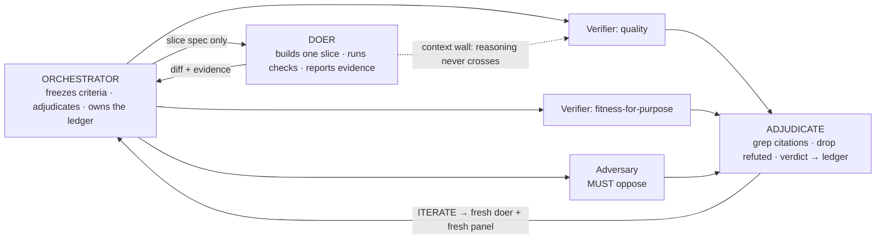

# tribunal

Verify a deliverable before it ships: a doer builds it, an independent panel judges it,
and an orchestrator adjudicates on evidence. Code slices, plans, documents, audits — any
artifact a single review pass can get wrong.

The orchestrator freezes acceptance criteria, dispatches a doer, then convenes a
context-walled panel of independent verifiers — including an adversary with a must-oppose
mandate — that score against the criteria with grep-checked evidence. Verdict:
SHIP / SHIP_WITH_CAVEATS / ITERATE / BLOCK / ESCALATE.

Principles-first: panel size, lenses, scoring dimensions, and prompts are derived per
artifact from a few hard invariants — not prescribed. Platform-agnostic; runs on any agent
that can spawn parallel subagents.

## Architecture

Each role is a separate agent in its own context — the doer finishes, the verifiers run in
parallel, blind to the doer's reasoning and to each other. Independence is the mechanism:
separate readers triangulate ground truth a single pass misses.

## Benchmarks

Blind-judged, against answer keys whose failures were executed (not asserted), scored
outcome-weighted. The only variable is whether the skill was installed.

**Cross-file verification** — a 6-file codebase with defects spanning module boundaries
(cause in one file, failure in another). Tier-weighted defect recall:

| Run | Recall | Verdict |
|---|---|---|
| Frontier model + tribunal | 0.79–0.81 | correct |
| Small model + tribunal (independent panel) | **0.75** | correct |
| Small model, single pass | 0.62 | correct |

The pattern lifts a small model's cross-file recall from 0.62 to 0.75 — approaching a model
tier above — by triangulating across independent readers. Across every run, model, and
configuration, the **verdict was correct** (8/8): calibration holds even where recall varies.

**Build-and-verify** — a 3-slice CLI against a 17-criterion spec:

| Run | Composite | Notable |
|---|---|---|
| With tribunal | ~9.5 / 10 | caught and escalated a genuine spec contradiction |
| Single pass | 8.35 / 10 | shipped the same contradiction silently |

## Usage

Install with [`npx skills`](https://skills.sh), then point an orchestrating agent at a
deliverable and its acceptance criteria. See [SKILL.md](SKILL.md); mechanics in
[references/](references/).

## License

MIT
